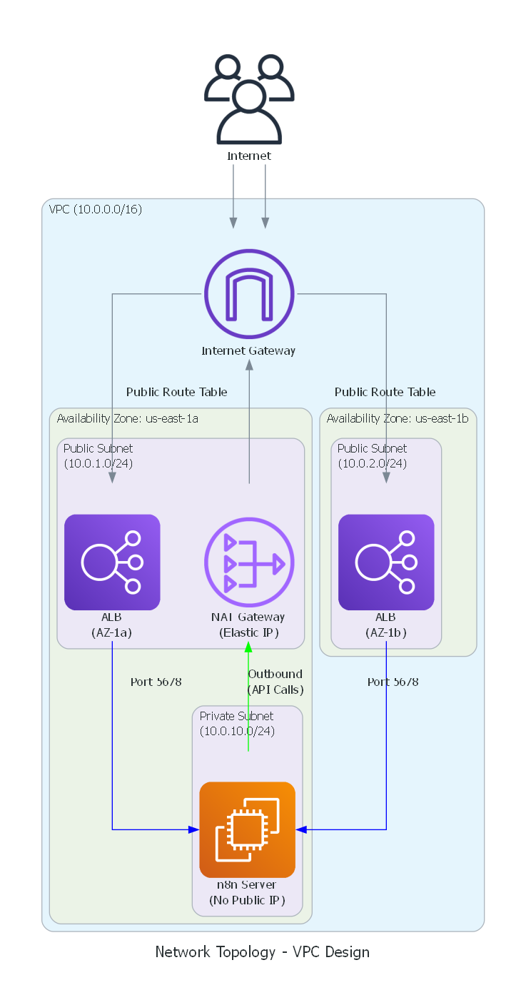
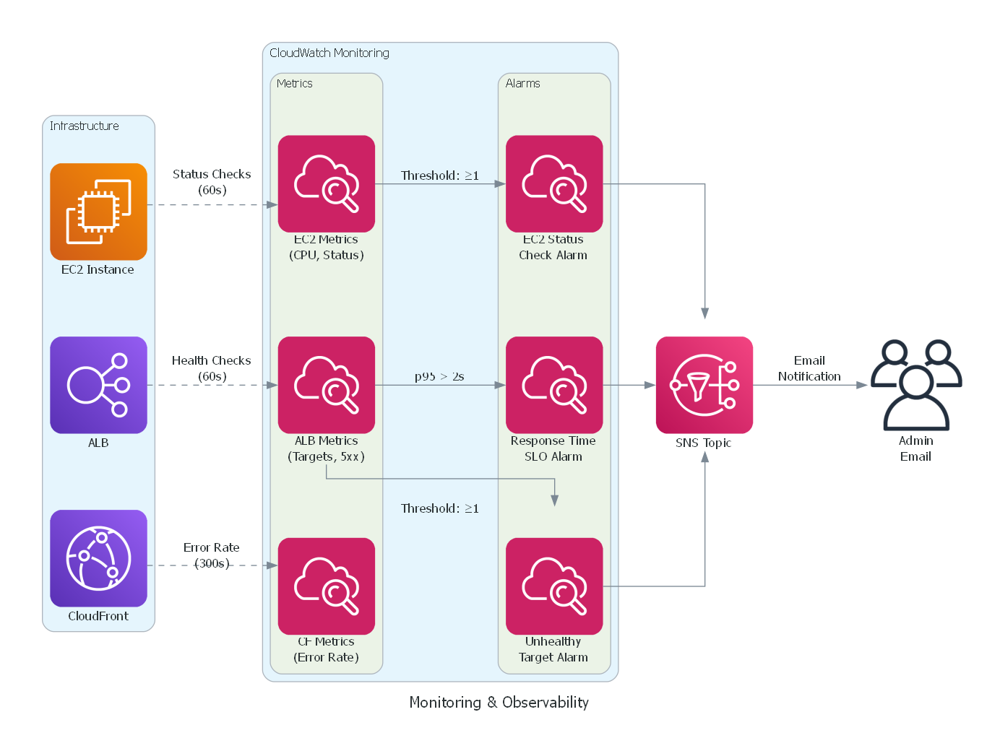

# Staff Absence Request System

> Enterprise-grade absence tracking and approval workflow system built with Infrastructure as Code, demonstrating production SRE practices and cloud architecture.

[](https://www.terraform.io/)
[](https://aws.amazon.com/)
[](https://aws.amazon.com/cloudwatch/)
[](https://aws.amazon.com/certificate-manager/)

**Live Demo:** https://absences.smaschool.org

---

## 🏗️ Architecture Overview


### Key Components

- **Frontend:** Static HTML form (S3 + CloudFront with HTTPS)
- **Backend:** n8n workflow automation (EC2 in private subnet)
- **Load Balancing:** Application Load Balancer with SSL/TLS termination
- **Networking:** Custom VPC with public/private subnet isolation
- **Monitoring:** CloudWatch alarms with SLO tracking
- **Security:** ACM certificate, IAM roles, security groups

---

## 🌐 Network Architecture



**Design Principles:**
- Private subnet for compute resources (no public IP)
- NAT Gateway for secure outbound connectivity
- Multi-AZ ALB deployment for high availability
- Security groups enforce least-privilege access

---

## 🔄 Workflow Automation

The absence request system uses n8n for workflow automation with conditional approval logic.

**Workflow Path:**
1. **Form Submission** → Webhook trigger
2. **Date Check** → Past or Future?
3. **Past Date** → Auto-approve → Log to sheet → Confirm email
4. **Future Date** → Principal approval → Coverage check → Log to sheet → Confirm email

**See:** [Workflow Documentation](workflows/README.md)

**Workflow JSON:** Available in `workflows/absence-approval-workflow.json` for import into n8n

---

## 📊 Monitoring & Observability



### Service Level Objectives (SLOs)

| Metric | Target | Measurement | Alarm Threshold |
|--------|--------|-------------|-----------------|
| **EC2 Health** | 100% uptime | Status checks (60s) | ≥1 failed check |
| **Target Health** | 100% healthy | ALB health checks (60s) | ≥1 unhealthy target |
| **Response Time** | 95% < 2s | ALB p95 latency (300s) | p95 > 2 seconds |

**Error Budget:** 99.9% uptime = 43.8 minutes downtime/month allowed

---

## 📁 Project Structure
```
staff-absence-request-system/
├── infrastructure/
│   ├── bootstrap/              # Remote state backend (S3 + DynamoDB)
│   ├── modules/
│   │   ├── networking/         # VPC, subnets, NAT, security groups
│   │   ├── compute/            # EC2, IAM roles, user data
│   │   ├── load_balancer/      # ALB, target groups, HTTPS listeners
│   │   ├── frontend/           # S3 bucket, CloudFront distribution
│   │   ├── dns/                # ACM certificate reference
│   │   └── monitoring/         # CloudWatch alarms, SNS topics
│   ├── main.tf                 # Root module orchestration
│   ├── backend.tf              # S3 remote state configuration
│   ├── variables.tf            # Input parameters
│   └── outputs.tf              # Deployment outputs
├── diagrams/
│   ├── generate_diagrams.py    # Auto-generate architecture diagrams
│   └── output/                 # Generated PNG diagrams
├── frontend/
│   └── index.html              # Absence request form
└── docs/                       # Additional documentation
```

---

## 🚀 Deployment Guide

### Prerequisites

- AWS CLI configured (`aws configure`)
- Terraform >= 1.0
- Python 3.12+ (for diagrams)
- Custom domain with DNS access (for HTTPS)

### Step 1: Bootstrap Remote State (One-Time)
```bash
cd infrastructure/bootstrap
terraform init
terraform apply

# Note the outputs - you'll need them for backend.tf
terraform output backend_config
```

**What this creates:**
- S3 bucket: `hollers-absence-tfstate-<account-id>`
- DynamoDB table: `absence-system-terraform-locks`
- Versioning and encryption enabled

### Step 2: Configure Backend

Copy the bootstrap output to `infrastructure/backend.tf`:
```hcl
terraform {
  backend "s3" {
    bucket         = "hollers-absence-tfstate-123456789012"
    key            = "prod/terraform.tfstate"
    region         = "us-east-1"
    dynamodb_table = "absence-system-terraform-locks"
    encrypt        = true
  }
}
```

### Step 3: Request ACM Certificate
```bash
# Request certificate for your domain
aws acm request-certificate \
  --domain-name absences.yourdomain.org \
  --validation-method DNS \
  --region us-east-1

# Get validation records
aws acm describe-certificate \
  --certificate-arn <YOUR_CERT_ARN> \
  --query "Certificate.DomainValidationOptions[0].ResourceRecord"

# Add CNAME record to your DNS provider
# Wait for certificate status: ISSUED
```

### Step 4: Update DNS

Add CNAME record:
```
absences.yourdomain.org → absence-system-alb-XXXXX.us-east-1.elb.amazonaws.com
```

### Step 5: Deploy Infrastructure
```bash
cd infrastructure

# Update variables
cat > terraform.tfvars <<EOF
domain_name     = "absences.yourdomain.org"
enable_https    = true
alert_email     = "your-email@example.com"
EOF

# Initialize with remote backend
terraform init

# Review the plan (should show ~28 resources)
terraform plan

# Deploy!
terraform apply
```

**Deployment time:** ~10-15 minutes

### Step 6: Verify
```bash
# Get your endpoints
terraform output

# Test HTTPS
curl https://absences.yourdomain.org

# Check n8n is running
curl https://absences.yourdomain.org
```

---

## 🎯 Key Features

### Infrastructure as Code
✅ **Modular Design** - Reusable components (networking, compute, monitoring)  
✅ **Remote State** - S3 backend with DynamoDB locking for team collaboration  
✅ **Immutable Infrastructure** - Declarative configuration, version controlled  
✅ **Environment Parity** - Same modules work across dev/staging/prod

### Security
🔒 **Private Subnet Isolation** - EC2 has no public IP, only accessible via ALB  
🔒 **HTTPS Everywhere** - ACM certificate with automatic HTTP→HTTPS redirect  
🔒 **Least Privilege IAM** - Instance profile with minimal required permissions  
🔒 **Security Groups** - Network-level access control (port 5678 from ALB only)  
🔒 **Secrets Management** - AWS Secrets Manager integration ready

### Observability
📈 **CloudWatch Alarms** - EC2 health, ALB targets, response time SLOs  
📈 **SNS Notifications** - Email alerts on threshold breaches  
📈 **Distributed Tracing** - Request flow from form → ALB → n8n  
📈 **SLO Tracking** - Error budgets and availability percentiles

### High Availability
⚡ **Multi-AZ Load Balancer** - Deployed across 2 availability zones  
⚡ **Health Checks** - Automatic traffic routing away from unhealthy targets  
⚡ **Auto-Recovery** - EC2 instance recovery on status check failures  
⚡ **NAT Gateway** - Managed service with 99.95% SLA

---

## 🔧 Operations

### View CloudWatch Alarms
```bash
# List all alarms
aws cloudwatch describe-alarms \
  --query "MetricAlarms[?AlarmName contains 'absence-system'].AlarmName"

# Check alarm state
aws cloudwatch describe-alarms \
  --alarm-names absence-system-ec2-status-check-failed \
  --query "MetricAlarms[0].StateValue"
```

### Confirm SNS Subscription

**Check your email for AWS SNS confirmation!** You must click the link to receive alerts.

### Trigger Test Alarm
```bash
# Connect to EC2 (no SSH key needed - uses SSM)
aws ssm start-session --target <instance-id>

# Stop n8n to trigger unhealthy target alarm
sudo docker stop n8n

# Wait 2-3 minutes - alarm should trigger
# Restart n8n
sudo docker start n8n
```

### Update Infrastructure
```bash
# Make changes to Terraform modules
vim infrastructure/modules/compute/main.tf

# Preview changes
terraform plan

# Apply changes
terraform apply

# Commit to Git
git add .
git commit -m "feat: update compute instance type"
git push
```

---

## 🧪 Testing

### Validate Configuration
```bash
cd infrastructure

# Format code
terraform fmt -recursive

# Validate syntax
terraform validate

# Check for security issues (optional)
tfsec .
```

### Test Form Submission
```bash
# Submit test request
curl -X POST https://absences.smaschool.org/webhook/absence-request \
  -H "Content-Type: application/json" \
  -d '{
    "name": "John Doe",
    "email": "john@example.com",
    "date": "2026-02-20",
    "reason": "Medical appointment"
  }'
```

---

## 📈 Monitoring Dashboard

**Access CloudWatch:**
```
AWS Console → CloudWatch → Dashboards → absence-system-dashboard
```

**Key Metrics:**
- EC2 CPU Utilization
- ALB Request Count
- ALB Target Response Time (p50, p95, p99)
- ALB 5xx Error Count
- CloudFront Cache Hit Rate

---

## 🔒 Security Best Practices

- ✅ All secrets stored in AWS Secrets Manager (never in Git)
- ✅ IAM roles follow principle of least privilege
- ✅ EC2 instance in private subnet (no direct internet access)
- ✅ HTTPS enforced with automatic HTTP redirect
- ✅ Security groups restrict traffic (port 5678 from ALB only)
- ✅ S3 bucket encryption at rest
- ✅ CloudWatch logs retained for audit trail
- ✅ MFA enabled on AWS root account

---

## 🎓 Learning Outcomes

This project demonstrates:

**Infrastructure as Code:**
- Terraform module design and composition
- Remote state management with locking
- Data sources vs resources
- Output dependencies between modules

**Cloud Architecture:**
- VPC design with public/private subnet isolation
- NAT Gateway for secure outbound connectivity
- Application Load Balancer with HTTPS termination
- Multi-AZ high availability patterns

**Site Reliability Engineering:**
- SLO definition and tracking
- Error budget calculations
- Alerting strategy (failure detection vs SLO monitoring)
- Observability with CloudWatch

**DevOps Practices:**
- GitOps workflow (infrastructure changes via Git)
- Modular, reusable components
- Environment consistency
- Documentation as code

---

## 📚 Additional Resources

- [Terraform AWS Provider](https://registry.terraform.io/providers/hashicorp/aws/latest/docs)
- [AWS Well-Architected Framework](https://aws.amazon.com/architecture/well-architected/)
- [Google SRE Book - SLOs](https://sre.google/sre-book/service-level-objectives/)
- [n8n Documentation](https://docs.n8n.io/)

---

## 🤝 Future Enhancements

**For production deployment, consider:**

- [ ] CI/CD pipeline (GitHub Actions) with automated terraform plan on PRs
- [ ] Blue-green deployment strategy for zero-downtime updates
- [ ] Auto Scaling Group for EC2 (horizontal scaling)
- [ ] RDS for persistent workflow data storage
- [ ] ECS/Fargate instead of EC2 (container orchestration)
- [ ] CloudFront Lambda@Edge for form validation
- [ ] AWS WAF for DDoS protection
- [ ] Cost optimization with Reserved Instances
- [ ] Automated testing (Terratest, InSpec)
- [ ] Compliance scanning (tfsec, Checkov)

---

## 📝 License

MIT License - See [LICENSE](LICENSE) for details

---

## 👤 Author

**Dr. Brent Hollers**  
Director of IT | Cloud Solutions Architect  
📧 drhollers@gmail.com  
🔗 [LinkedIn](https://linkedin.com/in/brent-hollers)  
💻 [GitHub](https://github.com/brent-hollers)

---

<p align="center">
  <strong>Built with</strong><br>
  Terraform • AWS • CloudWatch • Python Diagrams • n8n
</p>

<p align="center">
  <em>Demonstrating enterprise-grade infrastructure automation and SRE practices</em>
</p>